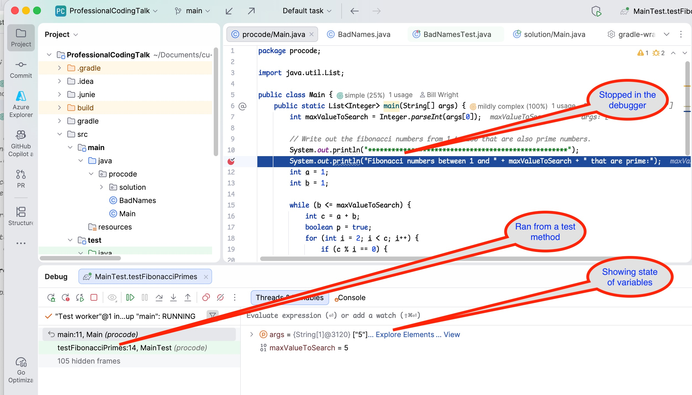

# Polymorphia Homework Sequence

This sequence of homework assignments is designed to 
give you practice in OO design and implementation using
the four pillars of OO:

* Abstraction
* Polymorphism
* Inheritance
* Encapsulation

## Homework 1

    Enter Name: George Fisher

* Get all the existing tests to pass
* Write one extra test that tests a fight between the adventurer and the creature. You can implement this in any fashion you like.
* Attached a screenshot of **running the above test, stopped at a breakpoint in the debugger**. An example of a screenshot is shown below. 



* Add the screenshot to your README.md file.
* Submit your homework to Canvas by submitting your GitHub repository URL.


    Note: When checking files into GitHub, be intentional about the files you add. Never do these commands:

```shell
> git add .
> git add *
```

Do not include compiled binaries, build directories (e.g., build/).
Sometimes it is appropriate to include IDE files like .idea/, but they are never required.
For this assignment, you should not have to add any files to the repository. You'll
just have to modify the existing files and add your test and screenshot.

